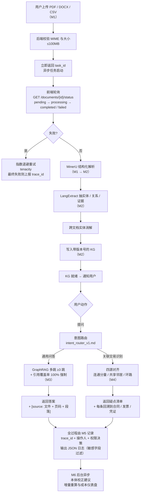

# 多模态企业知识库平台 · 产品整体大纲（MVP）

> **文档编号**：02-product-outline
> **版本**：v1.0
> **状态**：MVP 产品大纲（设计前）
> **上游依据**：`docs/01-research.md`（v1.0，条件性 GO 3.45 / 5，首靶 P3）
> **关联项目**：`GraphRAG-Agent`（PDF / DOCX / CSV → 解析 → 实体关系抽取 → 知识图谱 → 图谱增强问答）
> **口径**：**平台底座 + 单场景切入 + 大型企业私域部署优先**（已与项目发起人在澄清环节确认）

---

## 0. 摘要与任务分解

### 0.1 任务分解待办清单

- [x] **T1｜产品定位**：明确长期产品形态（通用平台）与 MVP 边界（P3 财务关联交易识别最小闭环）
- [x] **T2｜目标用户画像**：首期主用户 + P2 横向扩展对象
- [x] **T3｜MVP 6 模块**：M1–M6，每个模块功能点 ≤ 5，标注 P0 / P1 / P2
- [x] **T4｜模块优先级**：以表格化方式标注每模块优先级及配套指标
- [x] **T5｜用户主流程**：从上传到审计留痕的全链路流程图
- [x] **T6｜非目标 + MVP 准入线**：对齐 01-research §2.5.2 伪缺口与 §3.3 批准 / 反证条件
- [x] **T7｜落盘与验收**：写入 `docs/02-product-outline.md` 并按用户 5 项任务 + 2 项约束逐条核对

### 0.2 一句话产品定义

> **关键结论**：**"私域可部署的多模态企业知识库平台——MVP 1.0 以「财务关联交易识别」单场景切入验证图谱刚需，平台底座与权限审计同期上线。"**

---

## 1. 产品定位

### 1.1 长期产品定位（v1.0 之后的路线图）

| 维度 | 定位 |
|---|---|
| **产品形态** | 通用多模态企业知识库平台 |
| **核心能力** | 多模态解析（PDF / DOCX / CSV，扩展图片 / 网页）→ 实体关系抽取 → 知识图谱构建 → **可溯源**的图谱增强问答（GraphRAG） |
| **差异化护城河** | 私域可部署 + 本体可逐步校正 + 答案可溯源到实体与原文 + 成本可控的一体化交付（对应 `01-research.md` GAP-T1、T2、T3、T5、T6） |
| **目标能力顺序** | **可溯源引用（必入）→ 多跳 ≥3 跳（核心差异）→ 中文复杂表格 → 本体半自动 → 增量更新 → 权限与审计** |
| **不做** | 通用 chat-with-PDF、个人版、通用编辑器 AI、全自动零人工图谱、炫技可视化（对应 GAP-F1 / F3 / F4 / F2 / F5） |

### 1.2 MVP 范围边界（**仅 1 个场景**）

> **关键结论**：MVP 1.0 仅交付**一个场景的最小闭环**——**P3 财务关联交易识别与合同-发票-凭证三方核对**。其余 4 条 Top 5 痛点（投研穿透 / 法务条款 / 合规映射 / 运维影响面）**不进入 MVP**，列入第 7 节"扩展路线"。

**MVP 范围包含**：6 个模块（M1–M6）+ 1 个首靶场景（M4 财务关联交易识别）。
**MVP 范围不包含**：跨系统连接器、多租户拆 Org、可视化探索、投研穿透 / 法务 / 合规 / 运维 4 条场景。

> 理由（E3，置信度高）：`01-research.md` §3.3 的"条件性 GO"明确**不批准全量立项**，先以"单场景 + 平台底座 + 权限与审计"做最小验证——把"图谱刚需"与"图谱不值"两件事同时验证清楚。

---

## 2. 目标用户画像

### 2.1 首期主用户（MVP 1.0 的付费 / 验证对象）

| 维度 | 描述 | 与 research 对应 |
|---|---|---|
| **岗位** | **中大型企业内部审计 / 外审驻场 / 财务共享中心**；次级触达**合规风控 / 法务合同管理** | 01-research §1.4 P3 + P4 / P2 延伸 |
| **场景** | 关联交易识别、关联方披露核查、合同-发票-凭证三方核对 | 01-research §1.4 P3 |
| **数据敏感度** | **极高**：合同、发票、凭证含商业秘密与监管数据，**数据不出内网**为硬约束 | 01-research 假设 A12（E4，待验证） |
| **决策权** | **强**：审计结论 / 关联交易披露直接影响财报与企业声誉，预算与替换意愿均成立 | 01-research 假设 A1 / A7（E4） |
| **付费意愿** | **中高**：合规与审计为预算驱动型支出；替换动力来自"隐性关联漏检的潜在风险" | 01-research §1.3 维度 5 |
| **使用门槛** | **中**：内部用户对工具接受度高，但**对错误率零容忍**（错报关联 = 误伤，错漏关联 = 审计风险） | 01-research §1.4 P3 通过线 |

### 2.2 P2 横向扩展对象（**不进 MVP**，列入扩展路线）

| 岗位 | 入口痛点 | 与 research 对应 |
|---|---|---|
| 投研 / 行研分析师 | P1 股权与供应链穿透 | 01-research §1.4 P1 |
| 法务合同管理 | P2 主协议 + 附件 + 补充协议条款一致性 | 01-research §1.4 P2 |
| 合规风控岗 | P4 监管法规义务映射 | 01-research §1.4 P4 |
| SRE / 运维 / 发布经理 | P5 变更影响面分析 | 01-research §1.4 P5 |

> **关键结论**：**MVP 不为这些场景预留专有模块，但 6 个平台底座模块（M1 / M2 / M3 / M5 / M6）足以承载它们的后续扩展**，无需重构底座即可在 P2 阶段逐一补齐场景适配层。

---

## 3. MVP 功能模块（6 个，每模块功能点 ≤ 5）

### 3.1 模块总览（优先级矩阵）

| # | 模块 | **优先级** | 一句话定义 | 关联 Prompts（`prompts/`） | 对应 research 证据 |
|---|---|---|---|---|---|
| **M1** | 多模态文档接入与异步解析 | **P0** | 上传 PDF / DOCX / CSV，立即返回 `task_id`，后端异步执行解析 | `document_parse_v1.md` | 01-research §3.4 M0–M1 |
| **M2** | 实体关系抽取与知识图谱构建 | **P0** | MinerU 解析 → LangExtract 抽实体 / 关系 / 证据 → 实体消解 → 写入带版本号的 KG | `chunk_summary_v1.md` · `entity_relation_extract_v1.md` | 01-research §1.4 P3 / §3.1.2 能力 2–3 |
| **M3** | 图谱问答与可溯源引用 | **P0** | 多跳 ≥ 3 跳查询，**答案强制 100% 引用回溯**到原文 span | `intent_router_v1.md` · `kg_qa_v1.md` | 01-research §3.1.2 能力 1–2 / §3.3 批准条件 C2 |
| **M4** | 财务关联交易识别（首靶场景） | **P0** | PDF 合同 + CSV 发票 / 凭证四源对齐 → 连通分量 / 环路 / 共享邻居检测 → 疑点清单 | `entity_relation_extract_v1.md` · `kg_qa_v1.md` | 01-research §1.4 P3 / §3.3 批准条件 C1–C2 |
| **M5** | 权限隔离与审计留痕 | **P0** | 角色 / 文档 / 场景三粒度权限 + `trace_id` 全链路 JSON 日志 + 敏感字段过滤 | — | 01-research §3.1.2 能力 6 / GAP-T6 / 假设 A12 |
| **M6** | 本体管理与增量更新 | **P1** | 本体 schema 半自动冷启动 + 人工校正闭环 + 增量文档触发局部重算 | `entity_relation_extract_v1.md` | 01-research §3.1.2 能力 4–5 / GAP-T2 / GAP-T5 |

**优先级总览**：
- **P0（必做上线）**：M1 / M2 / M3 / M4 / M5 —— **共 5 个模块**，构成"端到端可演示"的最小产品。
- **P1（M1 期间并行打磨，M2 进入前必须完成）**：M6 —— 1 个模块，承担"能否用得起"的关键闭环。
- **P2（不进入 MVP，列入第 7 节扩展路线）**：跨系统数据源连接器、可视化图谱探索、多 Org 租户拆分、4 条横向场景（投研 / 法务 / 合规 / 运维）。

### 3.2 模块功能点（每模块 ≤ 5）

#### M1 · 多模态文档接入与异步解析 — **P0**

> **目标**：上传即返回，解析全程异步可观测，不阻塞用户。

1. **PDF / DOCX / CSV 上传 + MIME 与大小校验**（单文件 ≤ 100MB，遵循 `CODEBUDDY.md` 存储规范）。
2. **上传接口立即返回 `task_id`**（异步任务规范）。
3. **前端轮询 `GET /documents/{id}/status`**，状态机：`pending → processing → completed / failed`。
4. **解析失败指数退避重试**（tenacity 实现，遵循 `CODEBUDDY.md` 异步任务规范）。
5. **每请求携带 `trace_id`** 进入下游链路（为 M5 提供锚点）。

#### M2 · 实体关系抽取与知识图谱构建 — **P0**

> **目标**：把异构文档变成"带证据、带版本号"的可查询图。

1. **MinerU 结构化解析** PDF 表格 / 章节 / 脚注（保留版面与坐标）。
2. **LangExtract 抽实体 / 关系 / 证据**，输出 `{ entity, relation, evidence_span, confidence }`。
3. **跨文档实体消解**（全称 / 简称 / 曾用名 / 英文名归一），**支撑后续多跳查询不"撞名"**。
4. **写入带版本号的 KG**（每次写入 = 新版本，便于回滚与差异比对）。
5. **中文复杂表格优先**（覆盖招股书 / 合同附表 / 凭证清单）。

#### M3 · 图谱问答与可溯源引用 — **P0**

> **目标**：每个答案都能回跳到原文，否则就拒答。

1. **多跳 ≥ 3 跳查询**（沿关系链遍历，**这是相对普通 RAG 的唯一结构性差异**）。
2. **答案强制 100% 引用回溯**到原文 span `[source: 文件 + 页码 + 段落]`（**引用覆盖率不达标即判失败**，对应 §6 F3）。
3. **答案拒答兜底**：若无法溯源到任一原文 span，则**直接返回"无法回答"**，**严禁 LLM 编造引用**。
4. **单文档 / 跨文档切换**（用户在 UI 显式选择检索范围，避免误跨域）。
5. **意图路由**（`intent_router_v1.md`）：路由到通用问答（M3）或场景识别（M4）。

#### M4 · 财务关联交易识别（首靶场景）— **P0**

> **目标**：把 01-research §1.4 P3 的"图谱刚需"落地为一个可独立销售的场景能力。

1. **PDF 合同 + CSV 发票 + CSV 凭证 + CSV 供应商主数据 四源对齐**（**唯一能同时覆盖 CSV 结构化输入通道的 MVP 场景**，其他 Top 5 都以 PDF 为主）。
2. **主体-地址-法人-股东-电话 多类节点图建模**（建模即合规）。
3. **图连通分量 / 共享邻居 / 环路检测** 三类算法并行（疑点召回不依赖单一启发式）。
4. **疑点清单** + 每条疑点回溯到具体合同 / 发票 / 凭证；附 **三方金额不一致检出**作为高优先级信号。
5. **场景级门禁指标**：隐性关联召回 ≥ 0.80、误报率 ≤ 0.15、引用覆盖率 = 100%（对应 §6 批准条件 C2）。

#### M5 · 权限隔离与审计留痕 — **P0**

> **目标**：让大型企业敢把数据放进系统，且事后可追责。

1. **角色 / 文档 / 场景三粒度权限**（RBAC + ABAC 最小组合）。
2. **操作审计 + `trace_id` 全链路**，**JSON 格式日志**（loguru，遵循 `CODEBUDDY.md`）。
3. **敏感字段过滤**：日志中**禁止输出合同金额、发票号、税号、法人姓名等**（遵循 `CODEBUDDY.md` 安全底线）。
4. **私域部署开关**：禁云外发请求；LLM 调用允许"私域模型 / 私有化部署 / Mock"。
5. **限流与误用告警**（slowapi，遵循 `CODEBUDDY.md` 安全底线）。

#### M6 · 本体管理与增量更新 — **P1**

> **目标**：让系统"用得起"——能冷启动、能人工校正、能增量而非全量。

1. **本体 schema 半自动冷启动**（从首批 50 份样本自动建议实体 / 关系类型，**人工确认后才生效**）。
2. **人工校正闭环**（GUI 界面合并 / 拆分 / 重命名候选实体）。
3. **增量文档触发局部重算**（新增 / 修改文档只重算受影响子图，**不触发全量重建**）。
4. **增量 vs 全量成本仪表盘**（每千页文档的处理时长、token 用量、人工校正工时——对应 §6 批准条件 C3）。

> **优先级说明**：**M6 标 P1 而非 P0，是因为它不阻塞 MVP 端到端可演示**——但**进入 P2（横向场景扩展）前必须完成**，否则 P1 投研穿透等场景无法"用得起"。

---

## 4. 用户主流程

### 4.1 端到端主流程图

### 4.2 流程的关键设计取舍

| 取舍点 | 决策 | 理由 |
|---|---|---|
| **上传同步 vs 异步** | **异步**（上传立即返回 `task_id`） | 解析 + 抽取 + 图谱构建单次可能 30s+，**阻塞上传会拖垮前端体验且违反 `CODEBUDDY.md` 异步任务规范** |
| **状态查询频率** | 建议前端首次 2s 轮询，3 次后降为 10s（轮询上限可配置） | 平衡用户感知时延与后端压力 |
| **通用问答 vs 场景识别** | **同一入口 + 意图路由** | MVP 阶段用户不必理解模块边界；P2 多场景扩展时统一由 `intent_router_v1.md` 路由即可 |
| **答案不可溯源怎么办** | **拒答兜底** | **错误引用比"无法回答"更具破坏力**（对应 §6 F3 反证条件） |
| **审计日志放哪儿** | **结构化 JSON + trace_id 全链路** | 遵循 `CODEBUDDY.md` 日志与可观测性规则；同时是私域部署准入条件 |

---

## 5. 非目标（明确不做）

> 与 `01-research.md` §2.5.2 伪缺口 GAP-F1–F6 **逐项对齐**，**不预留扩展空间**。

| # | 不做 | 理由（引用 research） |
|---|---|---|
| **GAP-F1** | **通用 chat-with-PDF 横向功能** | ChatPDF / NotebookLM 已低价覆盖，用户不额外付费（E3 置信度 中–高） |
| **GAP-F3** | **面向个人的图谱问答** | 个人无多跳刚需，属伪需求（E3 置信度 中–高） |
| **GAP-F4** | **替换 Copilot / Notion 的通用编辑器 AI** | 正面撞巨头护城河，无胜算（E3 置信度 高） |
| **GAP-F2** | **全自动零人工的完美图谱** | 企业不愿为不确定的自动化买单；只愿为"可人工校正的半自动"付费（E3 置信度 中） |
| **GAP-F5** | **炫技式图谱可视化** | 用户不为"图好看"付费，付费点是与业务问题绑定（E3 置信度 中） |
| **GAP-F6** | **极致多跳 benchmark 分数** | 学术指标，企业不为榜单付费（E3 置信度 中–高） |

> **关键结论**：**MVP 不为以上 6 项预留任何资源。** 若产品阶段收到此类需求，统一按"非目标"挡回并记录诉求，待 P2 路线重新评估。

---

## 6. MVP 准入线与反证条件

> 本节**完全复述** `01-research.md` §3.3，是产品大纲与立项验证闭环的"硬约束"——**任何一条不达标，MVP 不进入全量发布。**

### 6.1 批准条件（C1–C3，必须**全部**满足）

| # | 条件 | 度量 | 验证方式 |
|---|---|---|---|
| **C1** | **图谱带来不可替代增益** | 图谱版相对纯 RAG 基线在"隐性关联召回 / 多跳答对率"上提升 **≥ 10%** | M4 最小实验的 A/B 对照 |
| **C2** | **质量达可用线** | 隐性关联召回 **≥ 0.80**、误报率 **≤ 0.15**、**答案引用覆盖率 = 100%** | M4 最小实验（200 合同 + 500 发票 + 100 凭证，20 组植入关联） |
| **C3** | **单位成本可接受** | 单份文档的"解析 + 抽取 + 图谱构建"成本落在预设阈值内，且**增量更新成本显著低于全量重建** | M6 成本仪表盘 |

### 6.2 反证条件（F1–F5，**任一**出现即停止投入或降级）

| # | 反证条件 | 应对 |
|---|---|---|
| **F1** | 图谱版相对 RAG 基线的增益 **< 10%** | 判定该场景"不需要图谱"，**退回 RAG-first 产品形态**，从路线图移除图谱依赖 |
| **F2** | 多跳答对率 / 影响面召回 **< 0.80** | **暂缓图谱化投入**，优先补齐抽取与实体消解质量 |
| **F3** | 引用覆盖率 **< 100%** | **直接 NO-GO**——该场景用户对不可溯源答案零容忍，产品无使用价值 |
| **F4** | 单位成本无法收敛到可接受区间 | **降级为"仅解析 + 结构化抽取"的轻量产品**，放弃图谱问答定位 |
| **F5** | 目标客户访谈显示"付费意愿 < 替换现有工具成本" | 重新评估 `01-research.md` §1.3 中"付费意愿"维度，**重算 Top 5 排序** |

---

## 7. 扩展路线（MVP 1.0 之后，**不进入 MVP**）

| # | 扩展项 | 优先级 | 入口依据 |
|---|---|---|---|
| **E1** | **P1 投研股权 / 供应链穿透**（复用 M1 / M2 / M3，新增场景适配层） | P2 | 01-research §1.4 P1 / §3.1.1 第二靶点 |
| **E2** | **P2 法务条款一致性**（复用 M1 / M2 / M3，**RAG-first 版本先行**） | P2 | 01-research §1.4 P2 |
| **E3** | **P4 合规义务映射**（复用 M1 / M2 / M3，**RAG-first 版本先行**） | P2 | 01-research §1.4 P4 |
| **E4** | **P5 运维变更影响面**（复用 M1 / M2 / M3，需对接 CMDB） | P2 | 01-research §1.4 P5 |
| **E5** | **跨系统数据源连接器**（ERP / OA / 工单 / 邮件） | P2 | 01-research §2.4.2 商业定位根因 8（Glean 护城河方向，**仅在客户明确要求时投入**） |
| **E6** | **多 Org 租户拆分** | P2 | 01-research §3.1.2 能力 6 延伸 |
| **E7** | **可视化图谱探索** | P2 | 警惕 GAP-F5，**仅在客户明确愿付费时投入** |

---

## 附录 A. 模块 × `prompts/` 映射

| 模块 | 使用的 Prompt（带版本号） | 用途 | 备注 |
|---|---|---|---|
| **M1** | `prompts/document_parse_v1.md` | 多模态解析指令 | 已有 v1 |
| **M2** | `prompts/chunk_summary_v1.md` | 抽取前 chunk 摘要 / 证据回链 | 已有 v1 |
| **M2** | `prompts/entity_relation_extract_v1.md` | 实体 / 关系 / 证据抽取（核心） | 已有 v1；新增场景需走版本号升级（**禁止原地覆盖**，遵循 `CODEBUDDY.md` Prompt 版本管理） |
| **M3** | `prompts/intent_router_v1.md` | 意图路由（问答 / 场景识别） | 已有 v1 |
| **M3 / M4** | `prompts/kg_qa_v1.md` | GraphRAG 答案生成（带 `[source: ...]`） | 已有 v1 |
| **M6** | `prompts/entity_relation_extract_v1.md` | 本体冷启动建议 | 与 M2 复用，**通过参数区分**（schema-suggestion 模式 vs extraction 模式） |

> **关键结论**：MVP 阶段**不新增 Prompt**，全部复用 `prompts/` 下已有的 5 个 v1 版本。P2 场景扩展时**新增版本号**（如 `kg_qa_v2.md`），不覆盖历史版本。

---

## 附录 B. 模块 × `01-research.md` 证据对应

| 模块 | 主要支撑证据 |
|---|---|
| **M1** | `01-research.md` §3.4 验证里程碑 M0–M1；`CODEBUDDY.md` 异步任务规范 + 存储规范 |
| **M2** | `01-research.md` §3.1.2 差异化能力 2（多跳 ≥3 跳）、3（中文表格）；§1.4 P3 ④ 本方案对应能力；假设 A3 / A4 |
| **M3** | `01-research.md` §3.1.2 差异化能力 1（可溯源引用 100%）、2（多跳）；§3.3 批准条件 C2 与反证条件 F3 |
| **M4** | `01-research.md` §1.4 P3 详解；§1.5 图谱化必要性（**本模块是图谱刚需的唯一 MVP 承载**）；§3.3 批准条件 C1–C2 与反证条件 F1 / F2 |
| **M5** | `01-research.md` §3.1.2 差异化能力 6；GAP-T6；假设 A12（私域硬需求）；`CODEBUDDY.md` 日志与可观测性 / 安全底线 |
| **M6** | `01-research.md` §3.1.2 差异化能力 4–5；GAP-T2 / GAP-T5；§3.3 批准条件 C3 与反证条件 F4 |

---

## 附录 C. 关键指标定义（MVP 准入线量化口径）

| 指标 | 定义 | 准入线 | 来源 |
|---|---|---|---|
| **隐性关联召回** | 模型正确识别出的隐性关联数 / 实际植入关联数 | ≥ 0.80 | research §1.4 P3 通过指标 / §3.3 C2 |
| **误报率** | 模型错误识别的关联数 / 模型识别出的总关联数 | ≤ 0.15 | research §1.4 P3 通过指标 / §3.3 C2 |
| **引用覆盖率** | 含可回溯原文 span 的答案数 / 总答案数 | **= 1.00**（硬约束） | research §3.1.2 能力 1 / §3.3 C2 / §3.3 F3 |
| **多跳答对率** | 3 跳内问题正确回答数 / 总多跳问题数 | ≥ 0.80 | research §1.4 P3 通过指标 / §3.3 F2 |
| **图谱相对 RAG 增益** | （图谱版指标 − RAG 基线指标）/ RAG 基线指标 | ≥ 10% | research §3.3 C1 / §3.3 F1 |
| **单文档处理成本** | （解析 + 抽取 + 图谱构建）的 token + GPU 综合成本 | 落入预设阈值 | research §3.3 C3 / §3.3 F4 |
| **增量 / 全量成本比** | 增量重算成本 / 全量重建成本 | 显著 < 1.00 | research §3.3 C3 |

---

## 附录 D. 与项目规则的引用一致性

| 项目规则（`CODEBUDDY.md`） | 本大纲中的落地模块 / 决策 |
|---|---|
| 异步任务规范（上传返回 `task_id` + 状态轮询 + 指数退避） | **M1** |
| 日志与可观测性（loguru JSON + `trace_id` 全链路） | **M5**（贯穿 M1–M4） |
| 错误响应规范（`{code, message, detail, trace_id}`） | **M1**（异步任务失败）+ **M5**（异常审计） |
| 安全底线（Pydantic 校验、slowapi 限流、日志禁敏感信息） | **M1**（MIME + 大小）+ **M5**（限流 + 敏感字段过滤） |
| 存储规范（抽象层 + 100MB + MIME 白名单） | **M1** |
| Prompt 版本管理（带版本号、只增不改） | **附录 A**（v1 复用，P2 新增版本号） |
| 契约先行（先改 `contracts/openapi.yaml`） | **P2 阶段实现前**（本大纲阶段**不落契约**，仅在附录 B 标明约束） |
| 角色隔离（frontend/ vs backend/ vs specs/） | 本大纲由"产品经理"角色产出，**不动 frontend/ / backend/ / contracts/ / prompts/ / specs/ / openspec/** |

> **关键结论**：**本大纲与 `CODEBUDDY.md` 全规则兼容，且明确把规则落地到具体模块**——后续设计阶段无需重新约定这些约束。

---

> **大纲结束。** MVP 1.0 的范围、模块、优先级、主流程、非目标与准入线已闭环对齐 `docs/01-research.md`。**v1.0 未包含任何实测数据；进入实现阶段前，需以 §6 的 C1–C3 与 F1–F5 为硬约束逐项验证。**