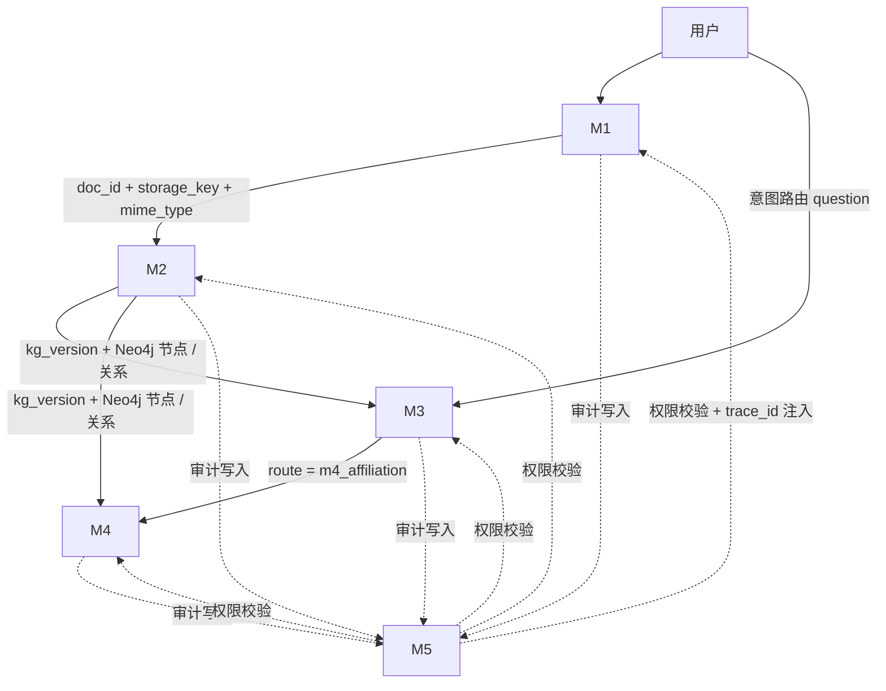

# GraphRAG-Agent 多模态企业知识库平台 · 汇总 PRD（MVP 1.0）

> **文档编号**：03-prd
> **版本**：v1.0
> **状态**：MVP 汇总 PRD（v1.0.0 已交付，实现态见 backend/CODEBUDDY.md §4）
> **上游依据**：`docs/01-research.md`（v1.0）、`docs/02-product-outline.md`（v1.0）
> **关联规格**：[specs/m1-async-ingest.md](../specs/m1-async-ingest.md)、[m2-extract-kg.md](../specs/m2-extract-kg.md)、[m3-graphqa-citation.md](../specs/m3-graphqa-citation.md)、[m4-affiliation-detection.md](../specs/m4-affiliation-detection.md)、[m5-permission-audit.md](../specs/m5-permission-audit.md)
> **关联 ADR**：[ADR-0001 异步任务后端选型](./adr/ADR-0001-async-task-backend.md)、[ADR-0002 Neo4j ↔ PostgreSQL 一致性边界](./adr/ADR-0002-neo4j-postgres-consistency.md)、[ADR-0003 跨租户资源隔离粒度](./adr/ADR-0003-tenant-isolation-rls.md)
> **技术栈**：React（Next.js 15 + TS + Tailwind）+ Python 3.11 + FastAPI + Pydantic + loguru + slowapi + tenacity + MinerU + LangExtract + LangChain + Neo4j + PostgreSQL

---

## 0. 文档目的与读者

- **目的**：汇总 MVP 1.0 的 5 个 P0 模块规格，提供跨模块依赖图、跨模块硬约束、端到端验收、数据架构总览与风险表，**作为实现阶段（后端开发 B / 前端 FE）的统一对齐基线**。
- **读者**：项目发起人、技术决策者、后端开发 B、前端 FE、QA / 测试。
- **不重复** 5 份规格中的细节；**以引用形式**指向具体规格文件 + 章节。

---

## 1. 背景与定位

### 1.1 产品定位（来自 `02-product-outline.md` §1，**关键结论**）

> **关键结论**：**长期定位为"通用多模态企业知识库平台"，但 MVP 1.0 仅交付 P3 财务关联交易识别最小闭环。** MVP 1.0 的 5 个 P0 模块中，**M4 是"图谱刚需"的唯一承载**——若 M4 未通过准入线（召回 ≥ 0.80 / 误报 ≤ 0.15 / 引用覆盖 = 100%），**整个 MVP 退回 RAG-first 产品形态**。

### 1.2 目标用户画像

- **首期主用户**：中大型企业内部审计 / 外审驻场 / 财务共享中心；次级触达合规风控 / 法务合同管理。
- **P2 横向扩展**：投研 / 行研（P1）、法务（P2）、合规（P4）、SRE / 运维（P5）（**均不进 MVP**）。
- **交付形态**：**大型企业私域部署优先**，数据不出内网为硬约束。

### 1.3 不做（与 `01-research.md` §2.5.2 GAP-F1–F6 对齐）

| # | 不做 | 理由 |
|---|---|---|
| GAP-F1 | 通用 chat-with-PDF 横向功能 | ChatPDF / NotebookLM 已低价覆盖 |
| GAP-F2 | 全自动零人工图谱 | 企业愿付费的是"可人工校正的半自动" |
| GAP-F3 | 个人版 | 个人无多跳刚需 |
| GAP-F4 | 通用编辑器 AI | 正面撞巨头护城河 |
| GAP-F5 | 炫技可视化 | 用户不为"图好看"付费 |
| GAP-F6 | 极致多跳 benchmark | 学术指标，企业不为榜单付费 |

---

## 2. MVP 模块清单与优先级

| # | 模块 | 优先级 | 规格文件 | 一句话 |
|---|---|---|---|---|
| **M1** | 多模态文档接入与异步解析 | **P0** | [specs/m1-async-ingest.md](../specs/m1-async-ingest.md) | 上传即返回，异步解析可观测 |
| **M2** | 实体关系抽取与知识图谱构建 | **P0** | [specs/m2-extract-kg.md](../specs/m2-extract-kg.md) | 解析 → 抽取 → 消解 → 带版本号写入 Neo4j |
| **M3** | 图谱问答与可溯源引用 | **P0** | [specs/m3-graphqa-citation.md](../specs/m3-graphqa-citation.md) | 多跳查询 + 100% 引用回溯 + 拒答兜底 |
| **M4** | 财务关联交易识别（首靶） | **P0** | [specs/m4-affiliation-detection.md](../specs/m4-affiliation-detection.md) | 四源对齐 + 三类算法 + 疑点清单 |
| **M5** | 权限隔离与审计留痕 | **P0** | [specs/m5-permission-audit.md](../specs/m5-permission-audit.md) | 三粒度权限 + trace_id + 敏感字段过滤 |
| M6 | 本体管理与增量更新 | **P1（不在本期 MVP）** | — | P2 进入前必须完成（详 `02-product-outline.md` §3.2 M6） |

> **关键结论**：**P0 = 5 个模块**，**P1 = 1 个（M6）**，**M6 不在 MVP 1.0 范围**。本期交付物仅含 M1–M5。

---

## 3. 跨模块依赖图

**依赖关系关键结论**：

1. **M1 是链路起点**，**无上游依赖**。
2. **M2 是图谱层唯一写入入口**，**M3 / M4 仅消费**（**任何绕过 M2 直接写 Neo4j 的代码路径都应被 lint 规则拦截**，详 M2 §5.5）。
3. **M5 是横向基础设施**，**被 M1–M4 调用**，**不调用任何业务模块**。
4. **M3 调用 M4**（通过意图路由），**M4 不调用 M3**。

---

## 4. 跨模块硬约束

> **本节是实现阶段不可绕过的硬约束表**，均来自 `CODEBUDDY.md` 或 `01-research.md` §6 准入线。

| # | 约束 | 来源 | 落实模块 | 规格章节 |
|---|---|---|---|---|
| **H1** | 异步任务状态机 `pending → processing → completed / failed` | CODEBUDDY.md | M1 / M4 | M1 §3 / M4 §3 |
| **H2** | 上传 ≤ 100MB + MIME 白名单（pdf/docx/csv） | CODEBUDDY.md | M1 | M1 §3 验收 2–3 |
| **H3** | 错误响应统一 `{code, message, detail, trace_id}` | CODEBUDDY.md | M1 / M3 / M4 / M5 | 各 §3 |
| **H4** | loguru JSON 日志 + `trace_id` 全链路 | CODEBUDDY.md | M5 提供 + M1–M4 消费 | M5 §5.3 |
| **H5** | 敏感字段脱敏（合同金额 / 发票号 / 税号 / 法人 / 银行 / 身份证 / 电话 / 文件名） | CODEBUDDY.md | M5 | M5 §4.5 |
| **H6** | 私域部署禁云外发（`PRIVATE_DEPLOY_ENABLED=true`） | CODEBUDDY.md + 假设 A12 | M5 | M5 §3 验收 4 |
| **H7** | slowapi 限流（默认 60 req/min/IP） | CODEBUDDY.md | M5 | M5 §3 验收 5 |
| **H8** | tenacity 指数退避 ≤ 3 次（初始 1s、倍数 2） | CODEBUDDY.md | M1 / M2 | M1 §3 验收 4 / M2 §3 验收 5 |
| **H9** | Prompt 版本管理（**MVP 复用 5 个 v1，P2 才新增版本号**） | CODEBUDDY.md | M2 / M3 / M4 | 各 §"关联 Prompts" |
| **H10** | 契约先行（`contracts/openapi.yaml` 由后端 B 在实现阶段写入） | CODEBUDDY.md | 实现阶段 | 各 §"API 端点草案" |
| **H11** | MVP 准入线 C1–C3：图谱相对 RAG 增益 ≥ 10% / 召回 ≥ 0.80 / 误报 ≤ 0.15 / 引用覆盖 = 100% / 单位成本可接受 | 01-research §3.3 + 02-product-outline §6 | M4（核心） + M3 | M4 §3 验收 6 / M3 §3 验收 2 |
| **H12** | 反证条件 F3（引用覆盖率 < 100% → 直接 NO-GO） | 01-research §3.3 | M3 / M4 | M3 §3 验收 2 / M4 §3 验收 4 |

> **关键结论**：**H1–H10 来自项目规则**（`CODEBUDDY.md`），**H11–H12 来自产品准入线**（`01-research.md` / `02-product-outline.md`）。**任一约束被绕过都应被代码评审驳回**。

---

## 5. 端到端跨模块验收（黄金路径）

> **场景**：用户上传 1 份合同 PDF + 3 份 CSV（发票 / 凭证 / 供应商主数据），系统识别出 ≥ 1 组隐性关联疑点，用户通过问答验证。

| 步骤 | 操作 | 期望响应 | 验证规格 |
|---|---|---|---|
| **1** | 上传 PDF + CSV（每文件 ≤ 100MB） | M1 立即返回 `task_id`，P95 ≤ 500ms | M1 §3 验收 1 |
| **2** | 轮询 `GET /documents/{id}/status` | 状态从 `pending → processing → completed` | M1 §3 验收 5 |
| **3** | M2 任务触发 | Neo4j 写入节点并生成 `kg_version`，落 `kg_versions` 表 | M2 §3 验收 4 |
| **4** | M4 关联交易识别完成 | 命中 ≥ 1 条疑点，引用覆盖率 = 100% | M4 §3 验收 4 + 6 |
| **5** | M3 提问"供应商 X 与公司 Y 是否存在关联" | 引用覆盖率 = 100% 或拒答（**不编造**） | M3 §3 验收 2 + 3 |
| **6** | 全链路审计 | `audit_log` 包含 ≥ 7 条记录（upload / parse / extract / affiliation / qa / role_check × N），**全部共享同一 `trace_id` 链** | M5 §3 验收 6 |
| **7** | MVP 准入线测试 | 图谱相对 RAG 增益 ≥ 10% + 召回 ≥ 0.80 + 误报 ≤ 0.15 + 引用覆盖 = 100% + 单位成本可接受 | H11 |

> **关键结论**：**任一步骤验收失败，整个 MVP 不能发布**。**M4 是核心**（若 M4 未通过准入线，对应反证条件 F1，**整个 MVP 退回 RAG-first 产品形态**）。

---

## 6. 数据架构总览

### 6.1 Neo4j（图存储）

| 节点 / 关系 | 来源模块 | 关键属性 |
|---|---|---|
| `:Document` / `:Chunk` | M2 | `kg_version, id, mime` |
| `:Entity` / `:Evidence` | M2 | `canonical_name, aliases, confidence, pii_flags` |
| `:HAS_CHUNK` / `:MENTIONS` / `:SUPPORTED_BY` | M2 | - |
| `:AFFILIATED_WITH` / `:SUPPLIES_TO` / `:PARTY_TO` | M2 | `share_pct, since, role` |
| `:Subject` / `:Address` / `:LegalPerson` / `:Phone` | M4 | `id_hash, number_hash`（仅哈希） |
| `:Invoice` / `:Voucher` / `:Contract` | M4 | `amount, invoice_no` |
| `:REGISTERED_AT` / `:LEGAL_REP` / `:SHARES_HOLDER` / `:CONTACT_PHONE` | M4 | `share_pct` |
| `:ISSUED` / `:POSTED_IN` / `:PARTY_TO` | M4 | `role` |

> **关键约束**：**所有节点 / 关系均带 `kg_version` 属性**，**查询必须按 `kg_version` 过滤**（M3 §3 验收 1 + M4 §3 验收 2）。

### 6.2 PostgreSQL（关系型存储）

| 表名 | 来源模块 | 用途 | 关键敏感字段 |
|---|---|---|---|
| `documents` | M1 | 文档元数据 + 异步任务状态 | `filename_hash, error_detail` |
| `kg_versions` | M2 | 图谱版本记录 | - |
| `entity_merge_candidates` | M2 | 实体消解候选 | - |
| `qa_logs` | M3 | 问答日志（仅哈希） | - |
| `affiliation_suspicions` | M4 | 关联交易疑点 | `evidence` |
| `affiliation_tasks` | M4 | 关联交易识别任务 | - |
| `unaligned_subjects` | M4 | 未对齐主体 | `raw_name` |
| `users` / `roles` / `user_roles` | M5 | 权限 | `password_hash` |
| `audit_log` | M5 | 操作审计 | `detail`（敏感字段已脱敏） |

### 6.3 存储分工原则

- **Neo4j**：图数据 + 图元数据（M2 / M3 / M4）
- **PostgreSQL**：元数据 + 业务表 + 权限 + 审计（M1 / M5 全量 + M2 / M3 / M4 业务表）
- **存储抽象层**：M1 文件存储（开发本地 / 生产 S3 / MinIO 切换）

---

## 7. Prompt 复用清单

> 来自 `02-product-outline.md` 附录 A；**MVP 1.0 不新增 Prompt 版本**。

| 模块 | Prompt（带版本号） | 用途 |
|---|---|---|
| M1 | `prompts/document_parse_v1.md` | 多模态解析指令 |
| M2 | `prompts/chunk_summary_v1.md` | 抽取前 chunk 摘要 |
| M2 | `prompts/entity_relation_extract_v1.md` | 实体 / 关系 / 证据抽取（核心） |
| M3 | `prompts/intent_router_v1.md` | 意图路由（问答 / 场景识别） |
| M3 / M4 | `prompts/kg_qa_v1.md` | GraphRAG 答案生成 |
| M6（**本期不含**） | `prompts/entity_relation_extract_v1.md` | 本体冷启动建议（参数区分） |

> **关键约束**（来自 `CODEBUDDY.md`）：**P2 场景扩展时新增版本号**（如 `kg_qa_v2.md`），**禁止原地覆盖历史版本**。

---

## 8. 风险与未决问题（TBD）

| # | TBD | 影响 | 决策窗口 | 状态 | 决策结论（核心要点） | 关联模块 | ADR |
|---|---|---|---|---|---|---|---|
| **TBD-1** | 异步任务后端选型 | M1 吞吐与重试语义 | 设计阶段 | ✅ **已决定** | **FastAPI `BackgroundTasks` + `TaskManager` 抽象层**：零新增依赖（不引入 Redis / Celery）；启动扫描 PostgreSQL 将遗留 `pending` / `processing` 置 `failed`（`TASK_INTERRUPTED`）；状态持久化于 DB，**禁止只存进程内存**；接口预留，可无缝替换 Arq / Celery | M1 / M4 | [ADR-0001](./adr/ADR-0001-async-task-backend.md) |
| **TBD-2** | Neo4j ↔ PostgreSQL 一致性边界 | M2 写入失败回滚语义 | 设计阶段 | ✅ **已决定** | **PostgreSQL 为 Source of Truth，先 PG 后 Neo4j + Saga 补偿**：`kg_versions` 先落 `writing` → 写 Neo4j → 置 `active`；Neo4j 失败则置 `failed` 且**不对外提供**；**查询层只认 `active`**，**绝不允许幽灵版本** | M2 / M3 / M4 | [ADR-0002](./adr/ADR-0002-neo4j-postgres-consistency.md) |
| **TBD-3** | `kg_version` 的回滚 API 设计（规格未列） | 影响审计可追溯性 | M1.0 末期 | ⏳ 待定 | — | M2 / M3 / M4 | — |
| **TBD-4** | 意图路由模型训练数据（`intent_router_v1.md` 的覆盖范围） | 影响 M3 → M4 的路由准确率 | M1.0 验证期 | ⏳ 待定 | — | M3 | — |
| **TBD-5** | 跨租户资源隔离粒度 | 私域部署安全 | **设计阶段（由"部署阶段"提前）** | ✅ **已决定** | **API 层强制注入 `org_id` + DB 层 RLS**：核心表全部含 `org_id`；启用 **`FORCE ROW LEVEL SECURITY`** + 受限 DB 角色；`storage_key` 以 `org_id` 为前缀；查询经 ORM / 中间件注入过滤，**严禁裸写 SQL** | M5（+ M1–M4 全量） | [ADR-0003](./adr/ADR-0003-tenant-isolation-rls.md) |
| **TBD-6** | M5 慢查询 / 大查询的 trace 采样策略 | 影响可观测性成本 | 实现期确定 | ⏳ 待定 | — | M5 | — |
| **TBD-7** | 反证条件 F4（单位成本）的具体阈值 | 影响 MVP 准入线 C3 | M1.0 验证期 | ⏳ 待定 | — | M2 / M4 | — |

> **关键结论**：**3 个设计阶段架构决策已收敛**（TBD-1 / TBD-2 / TBD-5 → **ADR-0001 / ADR-0002 / ADR-0003，状态均为 Accepted**），详见 [`docs/adr/`](./adr/)。其中 **TBD-5 的决策窗口由"部署阶段"提前至"设计阶段"**——隔离粒度是数据模型的**根属性**，一旦实现便散落于全部查询，无法在部署阶段追加。**TBD-3 / 4 / 6 / 7 仍按原窗口收敛**，**任一 TBD 不可拖延至实现完成之后**——届时架构已固化，调整成本会指数级上升。

> **落地前置条件**：**5 份规格已完成与 3 份 ADR 的同步**（规格同步记录见附录 C.1，`org_id` 覆盖度校验见附录 C.2）；**`contracts/openapi.yaml` 尚未生成**，须于**阶段三**统一补齐 `TASK_INTERRUPTED` / `KG_VERSION_NOT_ACTIVE` 错误码与租户隔离 403 语义。

---

## 9. 角色隔离与文档所有权（来自 `CODEBUDDY.md`）

| 角色 | 本期产出 | 后续产出 |
|---|---|---|
| **架构师**（本次） | `specs/m1..m5-*.md` + `docs/03-prd.md` + `docs/adr/ADR-0001..0003.md` | 设计文档（后续补充） |
| **后端开发 B** | — | `contracts/openapi.yaml` + `backend/app/` |
| **前端 FE** | — | `frontend/src/` |
| **测试 QA** | — | `tests/unit|integration|e2e/` |
| **部署 DevOps** | — | `docker-compose.yml` / `deploy/` |

> **本次 PRD 由架构师角色产出**，**仅动 `specs/` 与 `docs/`**。**未触碰** `frontend/`、`backend/`、`contracts/`、`prompts/`、`openspec/`、`specs/_template/`。

---

## 附录 A. 术语表

| 术语 | 含义 |
|---|---|
| `task_id` | 异步任务的唯一标识（UUIDv4） |
| `trace_id` | 全链路追踪标识（UUIDv4，跨模块一致） |
| `kg_version` | 知识图谱版本号（ISO 时间戳 + ULID） |
| `pii_flags` | 敏感字段标记（个人可识别信息） |
| ER | Entity-Relation，实体关系 |
| GraphRAG | Graph Retrieval-Augmented Generation |
| Cypher | Neo4j 查询语言 |
| RBAC | Role-Based Access Control |
| ABAC | Attribute-Based Access Control |
| slowapi | FastAPI 限流中间件 |
| tenacity | Python 指数退避重试库 |
| MVP | Minimum Viable Product |
| FMEA | Failure Mode and Effects Analysis |
| NO-GO | 终止条件（`01-research.md` §3.3） |
| TBD | To Be Determined，待决 |

---

## 附录 B. 与上游文档的引用映射

| PRD 章节 | 上游依据 |
|---|---|
| §1 产品定位 | `02-product-outline.md` §1 + `01-research.md` §3 |
| §1.3 不做 | `01-research.md` §2.5.2 + `02-product-outline.md` §5 |
| §2 模块清单 | `02-product-outline.md` §3.1 |
| §4 跨模块硬约束 | `CODEBUDDY.md` + `01-research.md` §3.3 |
| §5 端到端验收 | `01-research.md` §3.3 + `02-product-outline.md` §6 |
| §6 数据架构 | 各规格 §4 |
| §7 Prompt 清单 | `02-product-outline.md` 附录 A |
| §8 风险与 TBD | `01-research.md` §3.4 + `02-product-outline.md` §8 |

---

## 附录 C. 文件落清单

| # | 路径 | 角色 | 大致行数 |
|---|---|---|---|
| 1 | `specs/m1-async-ingest.md` | 架构师 | ~120 |
| 2 | `specs/m2-extract-kg.md` | 架构师 | ~140 |
| 3 | `specs/m3-graphqa-citation.md` | 架构师 | ~120 |
| 4 | `specs/m4-affiliation-detection.md` | 架构师 | ~140 |
| 5 | `specs/m5-permission-audit.md` | 架构师 | ~120 |
| 6 | `docs/03-prd.md` | 架构师 | ~180（本文件） |
| 7 | `docs/adr/ADR-0001-async-task-backend.md` | 架构师 | ~120 |
| 8 | `docs/adr/ADR-0002-neo4j-postgres-consistency.md` | 架构师 | ~110 |
| 9 | `docs/adr/ADR-0003-tenant-isolation-rls.md` | 架构师 | ~120 |

> **关键结论**：**9 个文件**（6 份规格 / PRD + 3 份 ADR）**均为新建**；其中 `docs/03-prd.md`（本文）在写入 TBD 决策后**被修改**（§8 TBD 表 + 文档头 + §9 + 附录 C）。**未触碰** `frontend/`、`backend/`、`contracts/`、`prompts/`、`openspec/`、`specs/_template/`、`.env*`。

### C.1 规格同步记录（对齐 ADR-0001 / ADR-0002 / ADR-0003）

| # | 文件 | 变更章节 | 对齐 ADR |
|---|---|---|---|
| 1 | `specs/m1-async-ingest.md` | §3 **新增验收 8**（启动回收 + `TASK_INTERRUPTED`）；§4.1 补 `status` 启动回收语义；§4.3 补 `storage_key` 前缀规则与越权校验；§5.5 数据流补回收分支；文档头补 ADR 溯源 | ADR-0001 / ADR-0003 |
| 2 | `specs/m2-extract-kg.md` | §3 验收 4 补「先 PG 后 Neo4j」写入时序与 `MERGE` 幂等键；§4.4 `kg_versions` 补 `writing` 状态 + `org_id` + `error_code` / `error_detail` / `reconciled_at` / `updated_at`；§4.5 补 `org_id`；§5.4 `GET /internal/kg/active` 明确仅 `active`；§5.5 数据流改三段式 | ADR-0002 / ADR-0003 |
| 3 | `specs/m3-graphqa-citation.md` | §3 验收 1 补「`kg_version` 必须为 `active`」；§4.1 `kg_version` 补非 `active` 显式拒绝（409 `KG_VERSION_NOT_ACTIVE`）；§4.3 `qa_logs` 补 `org_id`；§5.4 补 `active` 强制说明 | ADR-0002 / ADR-0003 |
| 4 | `specs/m4-affiliation-detection.md` | §3 验收 2 明确「共享同一 `active` `kg_version`」；§3 验收 7 补启动回收与 `TASK_INTERRUPTED`；§4.3 / §4.5 补 `org_id`；§4.4 `affiliation_tasks` 补 `org_id` / `retry_count` / `error_code` / `error_detail` | ADR-0001 / ADR-0002 / ADR-0003 |
| 5 | `specs/m5-permission-audit.md` | §3 **新增验收 8**（跨 org 隔离 + RLS 生效断言）；§4.2 `roles` 补 RLS 豁免声明；§4.3 `user_roles` 补 `org_id`；§4.4 `audit_log` 补 `org_id`；§5.3 补 `org_id` 注入中间件 | ADR-0003 |

**同步后状态**：**5 份规格全部对齐 3 份 ADR**；**8 张业务表 `org_id` 覆盖度 100%**（见 §C.2）。**`contracts/openapi.yaml` 本轮未修改**——按计划于**阶段三**统一生成（届时补 `TASK_INTERRUPTED` / `KG_VERSION_NOT_ACTIVE` 错误码与租户隔离 403 语义）。

### C.2 `org_id` 覆盖度校验（8 张业务表）

| # | 表 | 定义位置 | `org_id` |
|---|---|---|---|
| 1 | `documents` | M1 §4.1 | ✅ |
| 2 | `kg_versions` | M2 §4.4 | ✅ |
| 3 | `entity_merge_candidates` | M2 §4.5 | ✅ |
| 4 | `qa_logs` | M3 §4.3 | ✅ |
| 5 | `affiliation_suspicions` | M4 §4.3 | ✅ |
| 6 | `affiliation_tasks` | M4 §4.4 | ✅ |
| 7 | `unaligned_subjects` | M4 §4.5 | ✅ |
| 8 | `audit_log` | M5 §4.4 | ✅ |

> **补充**（权限域）：`users` 原有 `org_id` ✅；`user_roles` 本次补齐 ✅；`roles` 为全局字典表，按 ADR-0003 **显式豁免 RLS**。

---

> **PRD 结束。** MVP 1.0 的 5 个 P0 模块规格与汇总 PRD 已闭环对齐 `docs/01-research.md`、`docs/02-product-outline.md` 与 `CODEBUDDY.md`。**进入实现阶段前，需以 §5 的端到端验收与 §4 的跨模块硬约束为基线**，并以 §8 收敛的 **ADR-0001 / ADR-0002 / ADR-0003** 为设计阶段入口。**v1.0 未包含任何实测数据，所有准入线数值均来自上游文档，未经实测验证。**